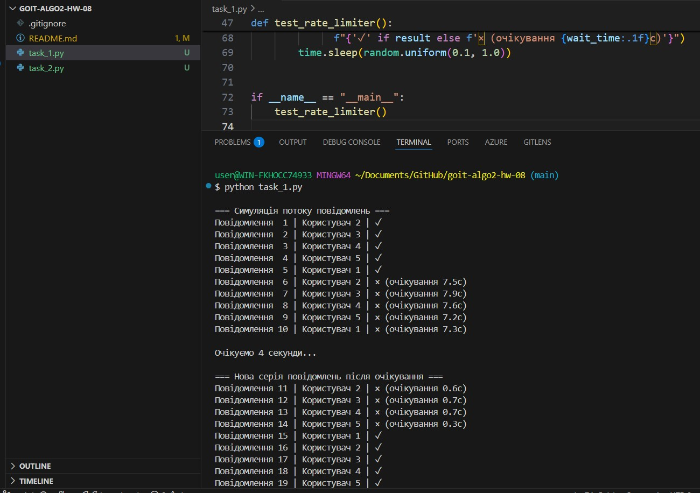
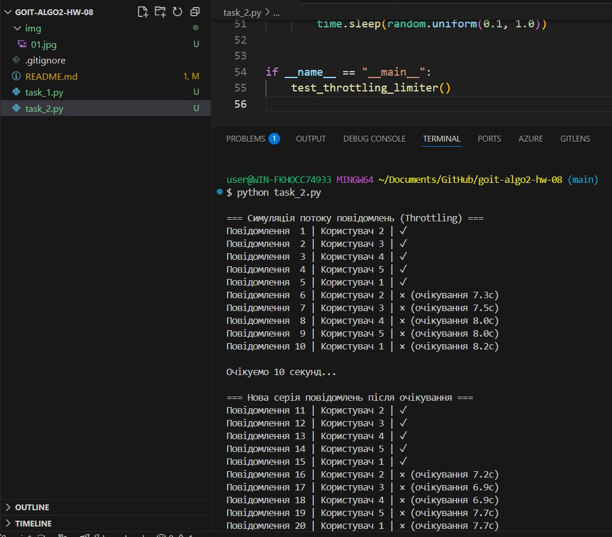

# neo-design-patterns-hw-06

# Rate Limiting Examples (Sliding Window & Throttling)

## Опис

Цей проєкт містить дві незалежні реалізації алгоритмів обмеження швидкості надсилання повідомлень користувачами.

- **task_1.py** — **Sliding Window Rate Limiter**  
  Використовує рухоме вікно (`deque`) для зберігання часу надсилання останніх повідомлень і обмежує їх кількість у заданому часовому проміжку.
- **task_2.py** — **Throttling Rate Limiter**  
  Дозволяє надсилати повідомлення лише з інтервалом не менше `min_interval` секунд від попереднього.

Обидва приклади симулюють потік повідомлень від кількох користувачів і показують, коли повідомлення відхиляється через перевищення ліміту.

---

## Запуск

python task_1.py

python task_2.py

## Приклад виводу (Sliding Window)

=== Симуляція потоку повідомлень ===
Повідомлення 1 | Користувач 2 | ✓
Повідомлення 2 | Користувач 3 | ✓
Повідомлення 3 | Користувач 4 | ✓
Повідомлення 4 | Користувач 5 | ✓
Повідомлення 5 | Користувач 1 | ✓
Повідомлення 6 | Користувач 2 | × (очікування 9.1с)

## Приклад виводу (Throttling)

=== Симуляція потоку повідомлень (Throttling) ===
Повідомлення 1 | Користувач 2 | ✓
Повідомлення 2 | Користувач 3 | ✓
Повідомлення 3 | Користувач 4 | ✓
Повідомлення 4 | Користувач 5 | ✓
Повідомлення 5 | Користувач 1 | ✓
Повідомлення 6 | Користувач 2 | × (очікування 9.5с)

